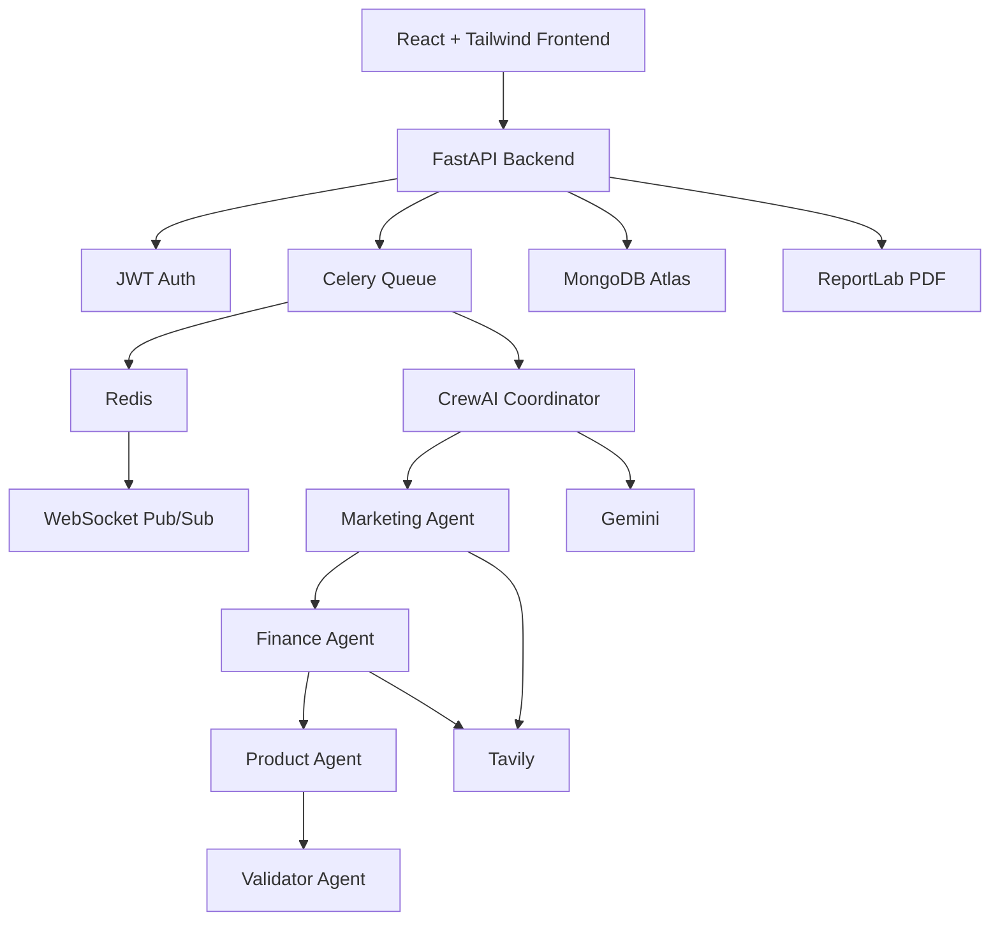

# StartupPilot AI Architecture

## Dependency contract

- Marketing starts from the original startup idea and optional research context.
- Finance receives the completed Marketing output.
- Product receives Marketing + Finance.
- Validator receives Marketing + Finance + Product.
- Important finance arithmetic is performed by Python, not trusted to the LLM.
- WebSockets expose safe progress events only; private reasoning is never streamed.
